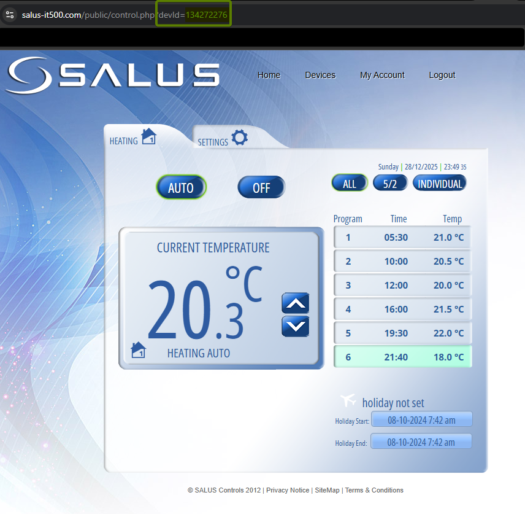
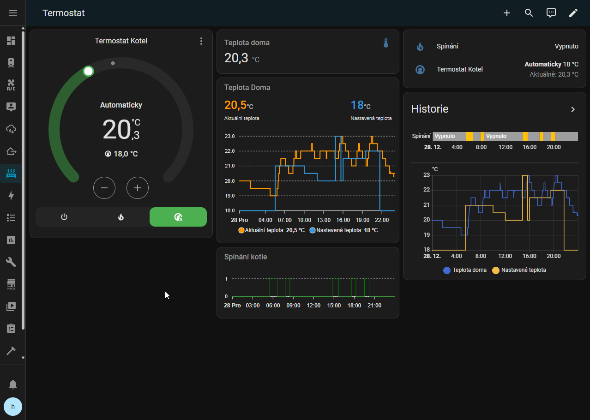

# Salus IT500 thermostat controller
Home assistant custom integration for thermostat Salus IT500

Manufacturer: https://saluscontrols.com/gb/product/it500bm-wireless-internet-controlled-thermostat/

### How to add into Home assistant
Copy whole folder salus_it500 into config/custom_components, add into configuration.yaml also.

like: config/custom_components/salus_it500

### Where to get device ID
https://salus-it500.com



### configuration.yaml
```yaml
salus_it500:
  username: "your_email"
  password: "your_password"
  name: "your_entity_name"
  device_id: "device_id"
```

### Usage
